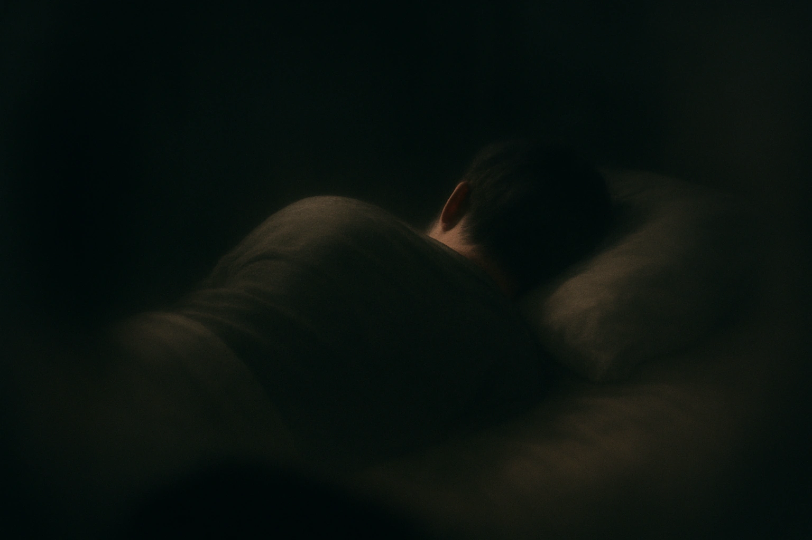

    <h1>Чек-лист осознанных сновидений</h1>
    
    

<!-- DeepWiki badge here: https://deepwiki.ryoppippi.com/ -->

## 1. Введение
Main language of this repostory is english, please read main [README.md](https://github.com/ebolblga/lucid-dream-checklist/blob/master/README.md) file if possible.

Пожелания и правки приветствуются — просто отправьте pull request, следуя [contribution guide](https://github.com/ebolblga/lucid-dream-checklist?tab=contributing-ov-file).

> [!CAUTION]
> Я не нейро- или ониролог, и уж тем более не медик — просто парень, составивший небольшой список идей, с которыми столкнулся в экспериментах с осознанными снами в детстве. Техники осознанных сновидений могут вызывать сбои сна, усиленные гипнагогические образы, тревогу или длительное сонное оцепенение. Пробуйте на свой страх и риск.

Мне кажется, мало кто заходит так далего с осознанными сновидениями, большинство моих друзей признавались что испытывали их всего один-два раза за всю жизнь. Но на самом деле можно научиться вызывать осознанные сны чаще и делать с ними многое. Я давно хотел поделиться этим чек-листом - некоторые идеи было тяжело объяснить словами. К счастью, сейчас есть диффузионные модели для генерации изображений из текста. А недавно вышла первая open-source модель для генерации видео из текста — [Wan2.2](https://huggingface.co/Wan-AI/Wan2.2-T2V-A14B), хотя пока я её не использовал для визуальных примеров в репозитории.

> [!TIP]
> Форкните репозиторий и постепенно отмечайте пункты, которые уже попробовали.

## 2. Термины и сокращения  
> **Осознанный сон** — это сон, в котором вы понимаете, что спите, пока он происходит.

> **NPC (non-player character)** — персонаж сна, создаваемый подсознанием во время фазы REM. Эти сущности составляют из фрагментов памяти и социальных шаблонов (вероятно, с участием гиппокампа и неокортекса), встроены в сюжет сна сетями default-mode, а эмоционально заряжены лимбическими структурами. При снижении предфронтального контроля они действуют по «сценарию», но когда вы становитесь осознанным, активный префронтальный кортекс позволяет вам менять или контролировать их роли.

Другие явления, которые мне удалось распознать и найти названия:
- [Синдром Алисы в стране чудес — Википедия](https://ru.wikipedia.org/wiki/%D0%A1%D0%B8%D0%BD%D0%B4%D1%80%D0%BE%D0%BC_%D0%90%D0%BB%D0%B8%D1%81%D1%8B_%D0%B2_%D0%A1%D1%82%D1%80%D0%B0%D0%BD%D0%B5_%D1%87%D1%83%D0%B4%D0%B5%D1%81)
- [Синдром взрывающейся головы — Википедия](https://ru.wikipedia.org/wiki/%D0%A1%D0%B8%D0%BD%D0%B4%D1%80%D0%BE%D0%BC_%D0%B2%D0%B7%D1%80%D1%8B%D0%B2%D0%B0%D1%8E%D1%89%D0%B5%D0%B9%D1%81%D1%8F_%D0%B3%D0%BE%D0%BB%D0%BE%D0%B2%D1%8B)
- [Гипнагогические галлюцинации — Википедия](https://ru.wikipedia.org/wiki/%D0%93%D0%B8%D0%BF%D0%BD%D0%B0%D0%B3%D0%BE%D0%B3%D0%B8%D1%8F)
- [Гипнический подерг — Википедия](https://en.wikipedia.org/wiki/Hypnic_jerk)
- [Сонный паралич — Википедия](https://ru.wikipedia.org/wiki/%D0%A1%D0%BE%D0%BD%D0%BD%D1%8B%D0%B9_%D0%BF%D0%B0%D1%80%D0%B0%D0%BB%D0%B8%D1%87)

## 3. Чек-лист  
### 3.1. Взаимодействие с разумом и подсознанием
- [ ] **Посмотреть в зеркало**  
  *Интересное ментальное упражнение: в отражении вы увидите образ, как вы себя запоминали, и ваши комплексы могут быть преувеличены.*

- [ ] **«Вылечить» или вызвать психическое расстройство**  
  *Нет надежных научных доказательств, что осознанные сны могут лечить болезнь. Но теоретически сонный мир можно использовать как терапевтический инструмент: визуализация новых реакций или переосмысление травм может изменить эмоциональные реакции.*

- [ ] **Попросить интересные идеи**  
  *Чаще всего NPC говорят бессмыслицу. Я однажды забыл что-то и решил спросить у подсознания - NPC ответил, но после пробуждения осознал, что это полная билиберда.*

- [ ] **Попросить у NPC математическую задачу**  
  *Как и в предыдущем случае, наиболее вероятен галлюцинаторный ответ - как от слабой LLM модели.*

- [ ] **Поговорить с подсознанием**  

- [ ] **Обсудить с подсознанием проблемы и способы их решения**  

### 3.2. Творческие и сенсорные эксперименты
- [ ] **«Поесть» несъедобный объект**  
  *Весёлый способ понаблюдать, как ум генерирует ощущения - бетон может казаться хрустящим.*
  

    
Пример изображения:

    
    
<b>Модель: GPT-4o</b>

    
Промпт: <i>"A first-person perspective: I’m in a dream and eating a block of concrete. I can see my hand holding block of concrete with a bite already taken out. The edges softly blurred as if through a foggy lens. Soft focus on the periphery adds to the dreamlike quality. The lighting is hazy but vivid, colors muted pastels with sudden glimmers of brilliance."</i>

    
  

- [ ] **Смоделировать сцены из фильмов**  
  *Не шокирует, но если это 50-й осознанный сон, может быть занятно.*

- [ ] **Смоделировать астральную проекцию** 
*Астральная проекция обычно описывается как «внетелесный опыт», когда кажется, что сознание отделяется от тела и может перемещаться. По сути это всё тот же осознанный сон: вы представляете, что отделяетесь от тела, смотрите на себя спящего и ходите по дому. Если хотите проверить, что это просто сон, а не какая-то «астральная проекция», посмотрите на часы, запомните время и попытайтесь разбудить себя. В реальной жизни время на часах наверняка будет отличаться от того, что придумал ваш мозг.*  
    

      
Пример изображения:

      
      
<b>Модель: <a href="https://chatgpt.com/" target="_blank">GPT-4o</a></b>

      
Prompt: <i>"A first-person perspective from my eyes. I'm in a dark room looking at someone sleeping. I can't see his face, because he is turned from me. The edges of the image are softly blurred as if through a foggy lens. Soft focus on the periphery adds to the dreamlike quality."</i>

    

- [ ] **Слушать музыку** 
*Слушать музыку внутри осознанного сна - удивительный опыт: мозг как бы сочиняет и исполняет музыку в реальном времени без внешнего источника.*

- [ ] **Посетить художественную выставку** 
*Ходят слухи, что некоторые знаменитые художники использовали сны как источник вдохновения.*

- [ ] **Управлять собой со сторонней перспективы (third-person view)** 
*Вид с плеча, как в Dead Space — тоже круто. Можно попробовать и 2D-мир: однажды после целого дня работы над клеточными автоматами мне приснился 2D-сон — странное ощущение.*

### 3.3. Манипуляции с физикой
- [ ] **Изменить логику и физические параметры** 
*Перевернуть гравитацию, представить мир без силы трения и т.д.*

- [ ] **Поднять объект в воздух (левитация)** 
*Очевидное действие.*
    

      
Пример изображения:

      
      
<b>Модель: <a href="https://chatgpt.com/" target="_blank">GPT-4o</a></b>

      
Prompt: <i>"A first-person perspective: I’m in a dream and levitating a soviet building using my hand. I can see my hand. The edges softly blurred as if through a foggy lens. Soft focus on the periphery adds to the dreamlike quality. The lighting is hazy but vivid, colors muted pastels with sudden glimmers of brilliance."</i>

    

- [ ] **Ускорить время** 
*И понаблюдать, как испаряются чёрные дыры и вселенная погружается во тьму.*

### 3.4. Манипуляции с телом
- [ ] **Представить, что вы противоположного пола, и заняться сексом** 
*Ещё один способ изучить, как мозг генерирует ощущения.*

- [ ] **Бесконечно кричать** 
*Если прямо сейчас попытаться кричать внутри головы (при наличии внутреннего монолога), вам будет сложно кричать бесконечно - появится ощущение, что нужно вдохнуть. В осознанном сне это проще сделать, так что воспринимайте как ментальное упражнение.*

- [ ] **Сделать себя невидимым** 
*«Человек-невидимка» (Hollow Man, 2000).*

- [ ] **Растянуть конечности на многие километры** 
    

      
Пример изображения:

      
      
<b>Модель: <a href="https://chatgpt.com/" target="_blank">GPT-4o</a></b>

      
Prompt: <i>"A first-person perspective: I’m in a dream and my limbs are stretching for many kilometres, I can see how my left leg disappears behind horizon, while my right hand is making big arch. My right leg and left hand are not in the field of view from my eyes. The edges softly blurred as if through a foggy lens. Soft focus on the periphery adds to the dreamlike quality. The lighting is hazy but vivid, colors muted pastels with sudden glimmers of brilliance."</i>

    

### 3.5. Манипуляции с пространством и перемещением
- [ ] **Пройти через стену** 
*Хорошее упражнение, чтобы научиться «телепортироваться».*
  
- [ ] **Пройти в зеркало** 
*Интересный способ проверить, как мозг симулирует такую ситуацию - может получиться необычно.*

- [ ] **Телепортироваться в случайное место** 
*По моему опыту, проще всего крутиться и представлять место, куда хотите переместиться. Можно также просто посмотреть на стену или землю и представить нужное место.*

- [ ] **Полететь** 
*Это первое, что люди часто пробуют в осознанном сне, но взлететь бывает нелегко. Это похоже на бег во сне: области мозга, ответственные за движение, активируются, но не полностью синхронизированы с обратной связью, которую мы обычно получаем во время бодрствования (например, ощущение удара стопы о землю). Из-за этого мозг «додумывает» опыт, и он может получаться искажённым - липкая поверхность, вялый бег и т.п.*

- [ ] **Испытать невесомость в космосе** 

## 4. Как чаще входить в осознанный сон  
Работают несколько стратегий, которые неплохо работают для меня:

1. **Метод MILD (Mnemonic Induction of Lucid Dreams)** — перед сном мысли о том, что хотите осознанно увидеть сон; это усиливает намерение.
2. **WBTB (Wake Back to Bed)** — установите будильник через ~4–6 часов после засыпания; проснувшись, подумайте об осознанных снах и снова усните.
3. **WILD (Wake Initiated Lucid Dream)** — засыпая, держите ум бодрым, пока тело расслаблено. Возможно, появятся образы или ощущение сонного оцепенения — оставайтесь спокойным, и сон может перейти в осознанный.

## Участники  

## [Лицензия](https://github.com/ebolblga/lucid-dream-checklist/blob/master/LICENSE.md)  
Этот проект распространяется под лицензией MIT. Пожалуйста, прочитайте файл License для условий использования.
